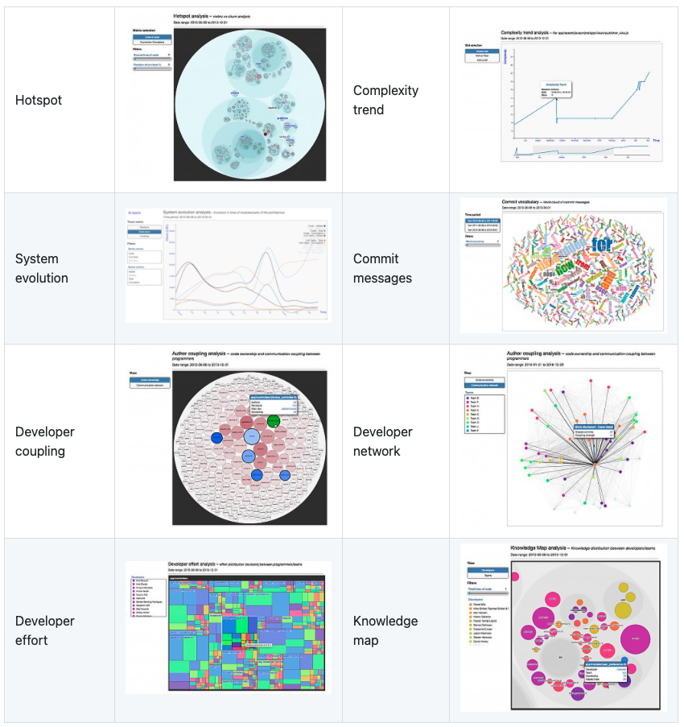

# code-forensics
Scripts to use code-forensics

`code-forensics` is a great tool developped by Silvio Montanari based on Adam Tornhill's book [Your Code as a Crime Scene](https://pragprog.com/titles/atcrime/your-code-as-a-crime-scene/).  
Visit the documentation [here](https://github.com/smontanari/code-forensics/wiki)

## Visualization


## How to use the script
This script is a shell script tested only on Mac OS

### Pre-requisites
* **Node.js** - Nodejs 4 or later

### Run the script
```bash
sh run-analysis.sh --projectName=<your-project-name> --repositoryPath=<path-to-the-repo-to-analyze>
```

It will :
* Remove folders from previous analysis : `tmp`, `output`
* Replace the `repositoryPath` variable in `gulpfile.js`
* Replace the `projectName` variable in `package.json`
* Install dependencies from `package.json`
* Run each type of analysis with default values :
    * dateFrom : `first commit date`
    * dateTo : `today`
    * targetFile : `/`
    * timeSplit : `end of month`
    
You can change analysis parameters by using the ones defined [here](https://github.com/smontanari/code-forensics/wiki/Configuration)

### Run the webserver
```bash
gulp webserver
```

Enjoy ;-)
